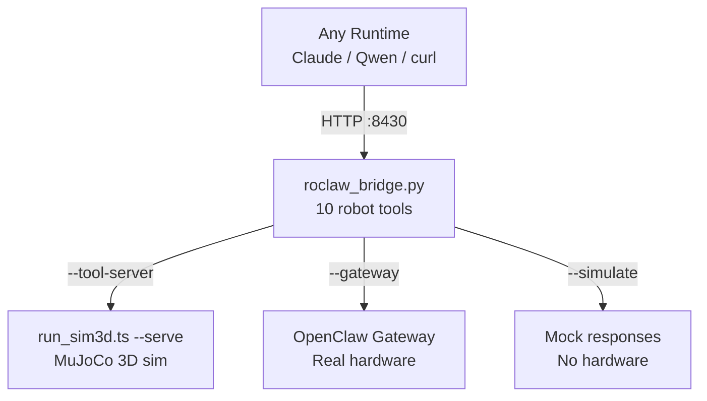
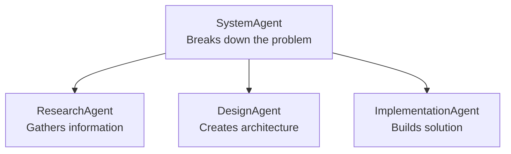

# SkillOS — Pure Markdown Operating System [POC]


SkillOS is a proof-of-concept OS where every component — agents, tools, memory, orchestration — is defined entirely in markdown documents. No code compilation. No complex APIs. Just markdown that any LLM interprets at runtime to become a powerful, composable problem-solving system.

> Evolved from [LLMos](https://github.com/EvolvingAgentsLabs/llmos) — testing Skills as basic programs.

## 🚀 Quick Start

### Prerequisites
- Python 3.11+
- Git

### Installation

```bash
# Clone the repository
git clone https://github.com/EvolvingAgentsLabs/skillos.git
cd skillos

# Initialize the agent system (v3.0 — skill tree aware)
./setup_agents.sh    # Mac/Linux
# OR
powershell -ExecutionPolicy Bypass -File .\setup_agents.ps1  # Windows
```

## 🎯 Choose Your Runtime

### Option 1: SkillOS Terminal (Recommended)
**Best for:** Interactive use, the full Unix-like experience
- Classic terminal REPL with `skillos$` prompt
- Markdown output rendered beautifully in terminal
- Auto-boots SkillOS, hides Claude Code internals
- Built-in commands: `help`, `status`, `projects`, `agents`, `history`

```bash
# Launch the SkillOS terminal
./skillos.sh
# Or directly with Python
python3 skillos.py
```

Once inside the terminal:
```
skillos$ Create a tutorial on chaos theory
skillos$ Monitor tech news and generate a briefing
skillos$ help
skillos$ status
```

> **Requirements:** Python 3.11+, `rich` (auto-installed on first run), Claude Code CLI

### Option 2: Claude Code (Direct)
**Best for:** Scripting, CI/CD, single-command execution

```bash
# Boot SkillOS
claude --dangerously-skip-permissions "boot skillos"

# Execute any goal
claude --dangerously-skip-permissions "skillos execute: 'Your goal here'"
```

### Option 3: Agent Runtime (Lightweight, Multi-Provider)
**Best for:** Learning, development, resource-constrained environments
- Provider-agnostic: supports **Qwen** (OpenRouter, free tier) and **Gemini** (Google AI)
- Auto-selects the right manifest per provider (`QWEN.md` for Qwen, `GEMINI.md` for Gemini)

```bash
pip install openai python-dotenv

# Run with Qwen (default, free tier via OpenRouter)
OPENROUTER_API_KEY=... python agent_runtime.py "Your goal here"

# Run with Gemini
GEMINI_API_KEY=... python agent_runtime.py --provider gemini "Your goal here"

# Control max turns for long-running tasks
python agent_runtime.py --provider gemini --max-turns 30 "Boot skillos and research AI safety"

# Interactive mode
python agent_runtime.py interactive
```

---

## 🧠 Hierarchical Skill System (v3.0)

Skills are organized in a **3-level taxonomy** with lazy loading for significantly reduced token consumption.

```
Domain → Family → Skill
────────────────────────────────────────────────────────
orchestration/  core/           system-agent
memory/         analysis/       memory-analysis-agent
                consolidation/  memory-consolidation-agent
                query/          query-memory-tool
                trace/          memory-trace-manager
robot/          navigation/     roclaw-navigation-agent
                scene/          roclaw-scene-analysis-agent
                dream/          roclaw-dream-agent
                tools/          roclaw-tool
                dream/          roclaw-dream-agent, roclaw-dream-consolidation-agent
validation/     system/         validation-agent
recovery/       error/          error-recovery-agent
project/        scaffold/       project-scaffold-tool
                packages/       skill-package-manager-tool
```

### Lazy Loading Protocol (4 steps)

Instead of loading the full component registry upfront, SkillOS uses a staged loading protocol:

```
Step 1  Identify domain from goal keywords        (no file reads)
Step 2  Load SkillIndex.md (~50 lines)        →  get domain index path
Step 3  Load domain/index.md (~30–60 lines)   →  select skill + manifest path
Step 4  Load skill.manifest.md (~15 lines)    →  confirm fit, get full_spec path
Step 5  Load full skill spec (~250–330 lines) →  invoke via Task tool
```

**Token savings vs. the old flat SmartLibrary.md approach:**

| Scenario | Before | After | Savings |
|----------|--------|-------|---------|
| Routing phase | 295 lines | 115 lines | **61%** |
| Single skill execution | 895 lines | 565 lines | **37%** |
| 3-agent pipeline | 1,646 lines | 1,130 lines | **31%** |

### Skill Inheritance

Each domain has a `base.md` defining shared behaviors. Child skills declare `extends: {domain}/base`
in their YAML frontmatter; the LLM merges inherited behaviors at runtime — no code needed.

```yaml
---
name: memory-analysis-agent
extends: memory/base        # inherits storage conventions, log format, query protocol
domain: memory
family: analysis
...
---
```

### Skill Manifests

Every skill has a lightweight 15-line manifest for routing decisions, separate from the full spec:

```yaml
---
skill_id: memory/analysis/memory-analysis-agent
name: memory-analysis-agent
type: agent
domain: memory
family: analysis
extends: memory/base
description: Cross-project pattern recognition and historical learning insights
capabilities: [pattern-recognition, historical-analysis, performance-prediction]
subagent_type: memory-analysis-agent
invoke_when: [historical context, pattern analysis, past execution insights]
full_spec: system/skills/memory/analysis/memory-analysis-agent.md
---
```

---

## 📚 Knowledge Representation System

> *Inspired by Andrej Karpathy's LLM Wiki pattern*

SkillOS includes a first-class knowledge domain that implements the **LLM-compiled wiki** pattern:
raw sources are compiled into a persistent, compounding wiki — not re-derived via RAG on every query.

```
raw/  →  wiki/  →  queries/
         ↑              ↓
     ingest/compile    filed back (compounding loop)
```

### Two Systems, One Bridge

| System | What it stores | Grows via |
|--------|---------------|-----------|
| `system/SmartMemory.md` | HOW executions went (procedural memory) | Append per execution |
| `projects/[KB]/wiki/` | WHAT was learned (declarative knowledge) | Compile + ingest + query |

### Five Knowledge Skills

```
knowledge-compile-agent  →  Full wiki build from raw/ (initialization or rebuild)
knowledge-ingest-agent   →  Incremental wiki update from new sources
knowledge-query-agent    →  Q&A with citations + files answers back to wiki/queries/
knowledge-lint-agent     →  Health checks: contradictions, orphan pages, broken links
knowledge-search-tool    →  Hybrid keyword + WikiLink graph search
```

### The Compounding Loop

Every query gets filed back into `wiki/queries/`. The next query benefits from all prior answers.
Every lint pass surfaces gaps. Every gap triggers new ingest. The wiki grows smarter over time.

```bash
# Start a knowledge base
skillos execute: "Initialize a knowledge base on transformer architectures"

# Add sources
skillos execute: "Ingest raw/papers/attention-is-all-you-need.md into the transformer KB"

# Query
skillos execute: "What are the key differences between MHA and MLA attention?"

# Health check
skillos execute: "Run a lint check on the transformer KB"

# Run the full demo
skillos execute: "Run the KnowledgeBase_Research_Task scenario"
```

### Wiki Structure (Obsidian-Compatible)

```
projects/[KBName]/
├── raw/                    # Immutable sources
├── wiki/
│   ├── _schema.md         # Wiki constitution (LLM's constitution for this KB)
│   ├── _index.md          # Auto-maintained content catalog
│   ├── _log.md            # Append-only operation log
│   ├── concepts/          # Core concept articles
│   ├── entities/          # People, papers, orgs, datasets
│   ├── summaries/         # Per-source summaries
│   └── queries/           # Filed Q&A outputs (compounding loop)
└── output/                # Marp slides, reports, images — viewable in Obsidian
```

Bootstrap a new wiki from the template:
```
templates/wiki/_schema.template.md
```

Full bridge protocol (skills ↔ wiki): `system/skills/knowledge/bridge.md`

---

## Core Concept

Everything is either an **Agent** (decision maker) or a **Tool** (executor), defined in markdown:

```markdown
---
name: example-agent
type: agent
description: An agent that solves problems
tools: Read, Write, WebFetch
extends: orchestration/base
---

# ResearchAgent
You are a research specialist. Given a topic, you...
```

The framework automatically:
- 🔍 Discovers available agents (via manifest files in `system/skills/`)
- 🎯 Routes to the right skill using the 4-step lazy loading protocol
- 🔄 Delegates work between specialized agents
- 📝 Executes tools based on agent decisions
- 🧬 Inherits shared domain behaviors via `extends:`

---

## 🏗️ Framework Architecture

```
skillos/
├── system/
│   ├── skills/                    # *** Hierarchical Skill Tree (primary) ***
│   │   ├── SkillIndex.md         # Top-level routing index (~50 lines)
│   │   ├── orchestration/        # Domain: workflow, goal execution
│   │   │   ├── base.md          # Shared orchestration behaviors
│   │   │   ├── index.md         # Domain index (~30 lines)
│   │   │   └── core/            # system-agent + claude-code-tool-map
│   │   ├── memory/              # Domain: learning, history, traces
│   │   │   ├── base.md
│   │   │   ├── index.md
│   │   │   ├── analysis/        # memory-analysis-agent
│   │   │   ├── consolidation/   # memory-consolidation-agent
│   │   │   ├── query/           # query-memory-tool
│   │   │   └── trace/           # memory-trace-manager
│   │   ├── robot/               # Domain: physical robot control
│   │   │   ├── base.md          # Cognitive Trinity shared behaviors
│   │   │   ├── index.md
│   │   │   ├── navigation/      # roclaw-navigation-agent
│   │   │   ├── scene/           # roclaw-scene-analysis-agent
│   │   │   ├── dream/           # roclaw-dream-agent
│   │   │   ├── tools/           # roclaw-tool
│   │   │   └── dream/           # roclaw-dream-agent, roclaw-dream-consolidation-agent
│   │   ├── knowledge/           # Domain: wiki compilation, Q&A, lint, search
│   │   │   ├── base.md          # 3-layer architecture (raw/wiki/schema)
│   │   │   ├── bridge.md        # Skills ↔ wiki connection protocol
│   │   │   ├── ingest/          # knowledge-ingest-agent
│   │   │   ├── compile/         # knowledge-compile-agent
│   │   │   ├── query/           # knowledge-query-agent
│   │   │   ├── lint/            # knowledge-lint-agent
│   │   │   └── search/          # knowledge-search-tool
│   │   ├── validation/          # Domain: health checks, spec integrity
│   │   ├── recovery/            # Domain: error handling, circuit breaker
│   │   └── project/             # Domain: scaffolding, packages
│   ├── agents/                   # Backward-compat redirect stubs → skills/
│   ├── tools/                    # Backward-compat redirect stubs → skills/
│   ├── SmartLibrary.md          # DEPRECATED redirect → SkillIndex.md
│   ├── SmartMemory.md           # Queryable experience database
│   ├── sources.list             # Skill package sources
│   └── packages.lock            # Installed skill tracking
├── projects/                     # Your projects (auto-created per goal)
│   └── [ProjectName]/
│       ├── components/agents/   # Dynamically created project agents
│       ├── output/              # Generated deliverables
│       ├── memory/short_term/   # Agent interaction logs
│       ├── memory/long_term/    # Consolidated insights
│       └── state/               # Execution state files
├── .claude/agents/              # Auto-populated for Claude Code discovery
├── setup_agents.sh              # v3.0 — skill tree aware setup
├── agent_runtime.py              # Multi-provider agent runtime
└── roclaw_bridge.py             # RoClaw HTTP↔WebSocket bridge
```

---

## 📦 Skill Package Management

SkillOS includes an apt-like package manager for installing skills from external repositories.

```bash
# Install a skill
skillos execute: "skill install research-assistant-agent"

# Search across all sources
skillos execute: "skill search quantum"

# Update all installed skills
skillos execute: "skill update"

# List installed skills
skillos execute: "skill list"
```

### Configured Sources (`system/sources.list`)

| Source | Repo | Path |
|--------|------|------|
| Anthropic | `anthropics/skills` | `skills/` |
| Hugging Face | `huggingface/skills` | `skills/` |
| OpenAI | `openai/skills` | `.curated/` |
| Google AI Edge | `google-ai-edge/gallery` | `skills/` |

Skills are tracked in `system/packages.lock` with source attribution, version, and content hash.
When a capability gap is detected during execution, SystemAgent automatically searches and installs the best matching skill.

---

## 🤖 Cognitive Trinity — RoClaw Physical Robot Integration

SkillOS serves as the **Prefrontal Cortex** in a three-part cognitive architecture for autonomous robotics:

| Component | Brain Region | Role |
|---|---|---|
| **[skillos](https://github.com/EvolvingAgentsLabs/skillos)** | Prefrontal Cortex | Planning, reasoning, dream consolidation, dynamic agent creation |
| **[RoClaw](https://github.com/EvolvingAgentsLabs/RoClaw)** | Cerebellum | VLM motor control, reactive navigation, trace emitter |

### Bridge Architecture



### 10 Robot Tools

`robot.go_to` · `robot.explore` · `robot.describe_scene` · `robot.stop` · `robot.status` · `robot.read_memory` · `robot.record_observation` · `robot.analyze_scene` · `robot.get_map` · `robot.telemetry`

### Quick Start (Simulation)

```bash
# Terminal 1: Start bridge in mock mode
python roclaw_bridge.py --port 8430 --simulate

# Terminal 2: Navigate
curl -s -X POST http://localhost:8430/tool/robot.go_to \
  -H "Content-Type: application/json" \
  -d '{"location": "kitchen"}'
```

---

## 🤝 Creating Custom Agents

1. **Define your agent** in markdown with hierarchy-aware frontmatter:

```markdown
---
name: my-domain-expert
description: Specialized agent for my domain
tools: Read, Write, Bash
extends: memory/base          # inherit domain behaviors
domain: memory                # or orchestration, robot, etc.
family: analysis
---

# MyDomainExpert
You are an expert in [domain]...
```

2. **Create a companion manifest** (15 lines) for efficient routing:

```yaml
---
skill_id: memory/analysis/my-domain-expert
name: my-domain-expert
type: agent
subagent_type: my-domain-expert
invoke_when: [domain-specific trigger keywords]
full_spec: projects/MyProject/components/agents/my-domain-expert.md
---
```

3. **Place in project folder**: `projects/MyProject/components/agents/`

4. **Use it immediately**:
```bash
"Use my-domain-expert to solve this problem"
```

---

## 🛠️ What Can You Build?

### Research & Analysis
```bash
"Research the latest AI developments and create a comprehensive report"
"Analyze this codebase and suggest improvements"
```

### Development
```bash
"Create a web application with user authentication"
"Build a data pipeline for processing CSV files"
```

### Content Creation
```bash
"Write a technical blog post about quantum computing"
"Create a tutorial for beginners on chaos theory"
```

### Complex Projects
```bash
"Design and implement a complete system for invoice processing"
"Create a multi-agent research system for market analysis"
```

---

## 📚 Advanced Features

### Multi-Agent Collaboration



### Sentient State Management

Each execution maintains modular state files in `projects/[ProjectName]/state/`:
- `plan.md` — current execution plan
- `context.md` — accumulated context
- `variables.json` — inter-agent data exchange
- `history.md` — full execution trace
- `constraints.md` — dynamic behavioral modifiers (adapt based on events)

### Memory-Driven Learning

Every execution is logged and consolidated for future improvement:

```
Short-term → projects/[Project]/memory/short_term/  (per session)
Long-term  → projects/[Project]/memory/long_term/   (consolidated patterns)
System     → system/SmartMemory.md                  (cross-project insights)
```

### Available Scenarios

```bash
# Live web research with real tool calls
skillos execute: "Run the RealWorld_Research_Task scenario in EXECUTION MODE"

# Quantum signal processing (three-agent cognitive pipeline)
skillos execute: "Run the Project Aorta scenario"

# Code analysis pipeline
skillos execute: "Run the CodeAnalysis_Task scenario on this repository"

# Physical robot navigation
skillos execute: "Navigate to the kitchen and describe what you see"
```

---

## 🔧 Configuration

### Environment Variables
```env
# For Qwen provider (OpenRouter)
OPENROUTER_API_KEY=your_key_here

# For Gemini provider (Google AI)
GEMINI_API_KEY=your_key_here

# For local Qwen (Ollama)
OLLAMA_HOST=http://localhost:11434
```

---

## 🌟 Why SkillOS?

- **Pure Markdown**: No code compilation — just markdown the LLM interprets
- **Hierarchical Skills**: Domain → Family → Skill taxonomy with lazy loading
- **Token Efficient**: 61% reduction in routing-phase token consumption
- **Extensible**: Add agents/tools as markdown without modifying core
- **Learning**: Every execution improves future runs via structured memory
- **Universal**: Works with any LLM that can read markdown

---

| Project | Role |
|---------|------|
| [LLMos](https://github.com/EvolvingAgentsLabs/llmos) | Predecessor — foundation concepts |
| [RoClaw](https://github.com/EvolvingAgentsLabs/RoClaw) | Physical robot — Cerebellum |

---

## License

Apache License 2.0 — see [LICENSE](LICENSE)

---

*Built by [Evolving Agents Labs](https://evolvingagentslabs.github.io)*
