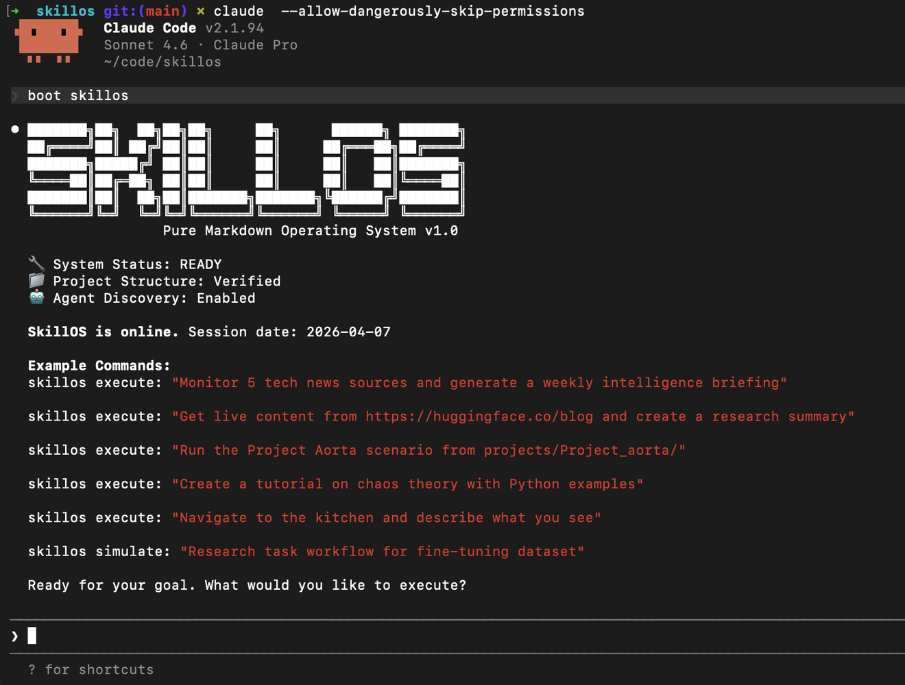
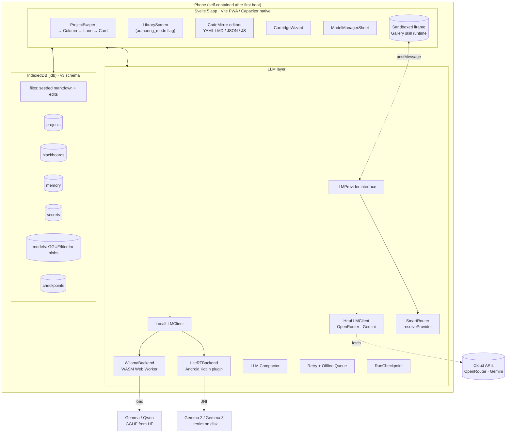
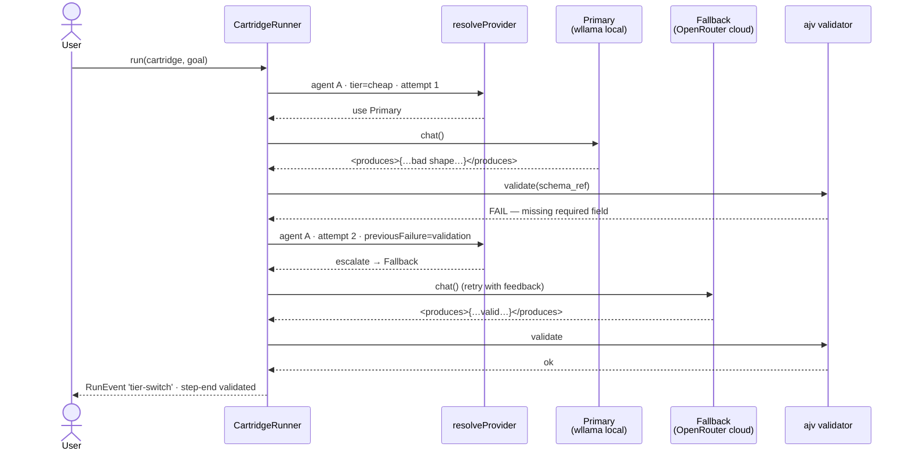
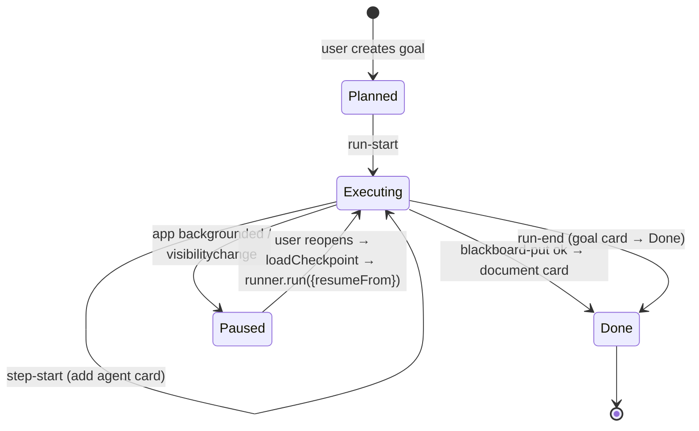

# SkillOS — Pure Markdown Operating System

SkillOS is a proof-of-concept OS where every component [agents, tools, memory, orchestration] is defined entirely in markdown documents. No code compilation. No complex APIs. Just markdown that any LLM interprets at runtime to become a composable problem-solving system.

> Evolved from [LLMos](https://github.com/EvolvingAgentsLabs/llmos) — testing Skills as basic programs.



---

## Quick Start

```bash
# 1. Clone the repo
git clone https://github.com/EvolvingAgentsLabs/skillos.git && cd skillos

# 2. Run Claude Code
claude --dangerously-skip-permissions

# 3. Boot SkillOS
boot skillos
```

### Full Setup (in case you want to explore alternative runtimes)

Initialize the agent discovery system before booting:

```bash
./setup_agents.sh    # Mac/Linux
.\setup_agents.ps1   # Windows
```

Requires: Python 3.11+, Git, Claude Code CLI. Optional: Node.js 18+ (for JS skills).

---

## Runtimes

### Option 1: SkillOS Terminal (Recommended)
**Best for:** Interactive use, the full Unix-like experience

```bash
./skillos.sh
# Or directly:
python3 skillos.py
```

```
skillos$ Create a tutorial on chaos theory
skillos$ Monitor tech news and generate a briefing
skillos$ help
```

> Requires: Python 3.11+, `rich` (auto-installed on first run), Claude Code CLI

### Option 2: Claude Code (Direct)
**Best for:** Scripting, CI/CD, single-command execution

```bash
claude --dangerously-skip-permissions "boot skillos"
claude --dangerously-skip-permissions "skillos execute: 'Your goal here'"
```

### Option 3: Agent Runtime (Multi-Provider)
**Best for:** Lightweight use, free-tier access, local/offline use

```bash
pip install openai python-dotenv

OPENROUTER_API_KEY=... python agent_runtime.py "Your goal here"            # Qwen (default)
GEMINI_API_KEY=... python agent_runtime.py --provider gemini "Your goal"   # Gemini
python agent_runtime.py --provider gemma "Your goal"                        # Gemma 4 (Ollama)
OPENROUTER_API_KEY=... python agent_runtime.py --provider gemma-openrouter "Your goal"  # Gemma 4 (OpenRouter)
python agent_runtime.py --sandbox e2b "Your goal"                           # E2B cloud sandbox
python agent_runtime.py interactive                                          # Interactive mode
```

For **Claude-Code-style subagents on Gemma 4** in sealed domains (cooking,
electrical design, …), use the Cartridge runtime — see
[Cartridges](#cartridges--gemma-native-subagents) below.

**Run multi-agent scenarios with any provider:**

```bash
# Cognitive pipeline — forces step-by-step execution for mid-tier models
python run_scenario.py scenarios/Operation_Echo_Q.md "quantum cepstral analysis" \
    --provider gemma-openrouter --no-stream

# Strategy auto-selects based on model tier (or override manually)
python run_scenario.py scenarios/ProjectAortaScenario.md "quantum arterial navigation" \
    --provider gemma-openrouter --strategy cognitive_pipeline --no-stream
```

**Gemma 4 on a free Colab GPU** — no local GPU needed:

```bash
# 1. Open notebooks/skillos_gemma4_colab.ipynb in Google Colab (T4 GPU)
# 2. Run all cells — you'll get a Cloudflare tunnel URL
# 3. On your local machine:
OLLAMA_BASE_URL=https://xxx.trycloudflare.com/v1 python agent_runtime.py --provider gemma "Your goal"
```

See [docs/tutorial-gemma4-colab.md](docs/tutorial-gemma4-colab.md) for the full walkthrough, [docs/runtimes.md](docs/runtimes.md) for setup and comparison, and [docs/cognitive-pipeline.md](docs/cognitive-pipeline.md) for the cognitive pipeline architecture.

---

## Core Concept

Everything is either an **Agent** (decision maker) or a **Tool** (executor), defined in markdown:

```markdown
---
name: example-agent
type: agent
description: An agent that solves problems
tools: Read, Write, WebFetch
extends: orchestration/base
---

# ExampleAgent
You are a research specialist. Given a topic, you...
```

Skills are organized in a **3-level hierarchy** (Domain → Family → Skill) with a 4-step lazy loading protocol that reduces routing-phase token consumption by ~61% versus a flat registry.

```
Domain → Family → Skill
──────────────────────────────────────────────────
orchestration/  core/           system-agent
                ingress/        intent-compiler-agent
                egress/         human-renderer-agent
memory/         analysis/       memory-analysis-agent
                consolidation/  memory-consolidation-agent
                query/          query-memory-tool
robot/          navigation/     roclaw-navigation-agent
                scene/          roclaw-scene-analysis-agent
                dream/          roclaw-dream-agent
dialects/       compiler/       dialect-compiler-agent
                expander/       dialect-expander-agent
                registry/       dialect-registry-tool
validation/     system/         validation-agent
recovery/       error/          error-recovery-agent
project/        scaffold/       project-scaffold-tool
                packages/       skill-package-manager-tool
```

---

## Key Features

- **Pure Markdown** — No code compilation. The LLM is the interpreter.
- **Hierarchical Skills** — Domain → Family → Skill taxonomy with 4-step lazy loading
- **Token Efficient** — 61% reduction in routing-phase token consumption
- **Cognitive Pipeline** — Recursive Context Isolation gives mid-tier models (Gemma 4 26B) the executive functioning of frontier models: 5K→28K output, 100% step pass rate, 50-100x cheaper ([docs](docs/cognitive-pipeline.md))
- **Cartridges** — Claude-Code-style subagents on Gemma 4 via sealed per-domain bundles (agents + JSON Schemas + deterministic validators). Typed blackboard, closed-set router, `<produces>{…}</produces>` contract with schema-validated retry. Reference cartridges: `cooking`, `residential-electrical` (IEC 60364), `demo` (11 JS skills). ([docs](docs/cartridges.md))
- **JS Skill Cartridges** — Run [Google AI Edge Gallery](https://github.com/google-ai-edge/gallery) JavaScript skills via Node.js. Skills can call Gemma 4 as subagents, persist state, and chain through the Blackboard. Three flow modes: deterministic (e2b), skill-chaining (pipelines), agentic (capable models). ([docs](docs/js-skills.md))
- **Mobile (Pure-JS) — v1 experimental** — 🧪 *Experiment, not production-ready. Device validation still needed.* A self-contained TypeScript + Svelte 5 + Capacitor app under `mobile/` that runs SkillOS cartridges on the phone. Ports the full runtime (Blackboard, CartridgeRegistry, CartridgeRunner, ajv validators, LLM tool-call loop, Gallery skills in a sandboxed iframe) and adds four v1 capabilities: **on-device LLM** (wllama WASM everywhere + LiteRT-LM Capacitor plugin on Android), **smart routing** (cartridge `preferred_tier` + agent `tier: cheap/capable` + local-first with cloud fallback on validation failure), **full in-app authoring** (CodeMirror editors for cartridges / agents / JS skills / schemas + new-from-blank wizard), and **resilience** (LLM-powered compaction, run checkpoint + resume, offline queue). 129 tests, 356 KB / 114 KB gzipped main bundle. ([docs](docs/mobile.md), [tutorial](docs/tutorial-mobile.md))
- **Dialects** — 14 domain-specific compression formats (50-99% token reduction) with Language Facade and cognitive scaffolding
- **Knowledge Wiki** — Compounding knowledge base inspired by Karpathy's LLM Wiki pattern
- **Memory System** — Every execution improves future runs via structured memory
- **Robot Integration** — SkillOS as Prefrontal Cortex for the RoClaw physical robot
- **Multi-Provider** — Works with Claude Code, Qwen, Gemini, Gemma 4 (Ollama + OpenRouter), or any OpenAI-compatible endpoint
- **Dynamic Agents** — New agents created as markdown at runtime, no restarts needed
- **Execution Sandboxing** — Path traversal prevention, restricted `exec()`, optional E2B cloud sandbox

---

## Dialects: Token Compression for Edge AI

SkillOS includes a **dialect framework** — 14 domain-specific compression formats that transform verbose content into minimal, actionable representations. Dialects reduce token cost by 50-99% while preserving (or improving) quality. A **Language Facade** (ingress/egress boundary agents) ensures agents never process verbose English internally, and 5 **cognitive scaffolding** dialects use formal notations (proofs, boolean logic, DAGs, stock-flow, SMILES) to improve reasoning quality.

**The three pillars:**

| Pillar | Dialect | Example | Reduction |
|--------|---------|---------|-----------|
| Hardware | `roclaw-bytecode` | `"Move forward"` → `AA 01 80 80 01 FF` | ~99% |
| Reasoning | `caveman-prose` | `"You should always run tests before pushing"` → `"Run tests before push."` | ~75% |
| Software | `strict-patch` | 500-line file rewrite → `[DEL:42]`/`[ADD:42]` (4 lines) | ~98% |

Plus 11 more: `strategy-pointer`, `trace-log`, `memory-xp`, `constraint-dsl`, `exec-plan`, `dom-nav`, `formal-proof`, `system-dynamics`, `boolean-logic`, `data-flow`, `smiles-chem`.

### Benchmark Results

Four automated benchmarks prove the architecture across three domains — code editing, mathematical reasoning, and scientific computation:

| Benchmark | Dialect | Token Reduction | Quality (Plain → SkillOS) | Key Result |
|-----------|---------|-----------------|---------------------------|------------|
| Code Editing (2 bug fixes in 993-line file) | `strict-patch` | **-97.5%** | 2/2 → 2/2 | 17x faster, 75% cheaper |
| Math (K_{3,4} spanning trees) | `formal-proof` | **-51.3%** | 90 → 90 /100 | Equal accuracy, 51% fewer tokens |
| Physiology (hemodynamics) | `system-dynamics` | **-61.1%** | 100 → 100 /100 | Identical accuracy, 61% fewer tokens |
| Analytical (cascade failure) | mixed | +251% (11 turns) | 100 → 100 /100 | Equal quality, multi-turn overhead |

All verification is automated (`ast.parse()` + regex + exact answer checks) — no LLM judge needed.

```bash
# Run benchmarks
python3 benchmarks/benchmark_patch.py        # Code editing: strict-patch
python3 benchmarks/benchmark_math.py         # Math: formal-proof
python3 benchmarks/benchmark_physiology.py   # Physiology: system-dynamics
python3 benchmarks/benchmark_dialects.py     # Analytical: mixed dialects
```

**Why it matters for small models:** Gemma 4B generates a strict-patch in 0.5s instead of 30s for a full rewrite — and gets it right. A 50,000-token HTML page becomes 80 tokens of interactive elements. The dialect removes the cognitive load, letting small models punch above their weight.

See [docs/dialects.md](docs/dialects.md) for the full guide.

---

## Cartridges — Gemma-Native Subagents

Cartridges are the answer to: **"Can we reproduce Claude Code's subagent experience using open-weights models like Gemma 4?"**

Yes — scoped per domain. A cartridge is a self-contained folder under `cartridges/<name>/` that pre-seals the plan space: declared agents, flows, JSON Schemas, tool allow-lists, and pure-Python validators. Gemma's job collapses from open-ended planning to structured slot-filling, which it handles reliably.

### Why this is different from the Cognitive Pipeline

| | Cognitive Pipeline ([docs](docs/cognitive-pipeline.md)) | Cartridges ([docs](docs/cartridges.md)) |
|---|---|---|
| Plan source | Scenario file written per task | Cartridge folder installed once, reused |
| Output shape | Markdown/Python files | Typed JSON on a blackboard |
| Safety rules | Live in prompts | Live in Python validators |
| Adding a domain | New scenario | New cartridge (one day of authoring) |
| Best for | One-off complex workflows | Recurring narrow-domain tasks |

### How it works

```
User goal  →  Registry match_intent (keyword)  →  Cartridge
                                                     │
                              router.md (closed-set) │
                                                     ▼
                                              Flow = [agent₁, agent₂, …]
                                                     │
                                    For each agent:  │
                                      · bundle blackboard inputs (spec.needs)
                                      · delegate via AgentRuntime
                                      · extract <produces>{…}</produces>
                                      · JSON-Schema validate → Blackboard
                                      · retry once on failure
                                                     │
                                                     ▼
                                      Pure-Python validators (no LLM)
                                                     │
                                                     ▼
                                             RunResult (snapshot + status)
```

Five stacked guardrails make Gemma reliable: keyword router (no LLM call), closed-set flow classifier (single-word LLM call), `<produces>` contract with balanced-brace fallback, per-step JSON Schema validation with one retry, and deterministic post-flow validators in Python.

### Quick start

```bash
# List installed cartridges
python -m cartridge_runtime --list

# Run the cooking cartridge against a goal (Gemma 4 on OpenRouter by default)
python -m cartridge_runtime cooking \
    "Plan meals for next week, 2 adults, vegetarian, Mediterranean"

# Residential electrical design with IEC 60364 compliance checking
python -m cartridge_runtime residential-electrical \
    "Design electrical for a 3-BR apartment with kitchen, 2 bathrooms"
```

From the SkillOS REPL:

```
skillos$ cartridges                                        # list
skillos$ cartridge cooking "plan meals for 4, vegetarian"  # explicit
skillos$ cartridge auto "design electrical installation"   # intent-match
skillos$ plan weekly menu for 2 vegetarians                # auto-dispatch
skillos$ claude <goal>                                     # bypass cartridges
skillos$ cartridge provider gemma                          # switch provider
```

Bare goals that strongly match a cartridge's `entry_intents` are auto-dispatched. `claude <goal>` forces the original Claude Code path.

### Reference cartridges shipped in this repo

| Cartridge | Type | Agents/Skills | Validator highlight |
|---|---|---:|---|
| `cartridges/cooking/` | standard | 3 agents (menu-planner → shopping-list-builder → recipe-writer) | Structural completeness (7 days × 3 slots) |
| `cartridges/residential-electrical/` | standard | 2 agents (load-calculator → circuit-designer) | **IEC 60364 subset** in ~80 LOC of Python — wire/breaker ratios, RCD on wet rooms, 25% breaker margin |
| `cartridges/demo/` | **js-skills** | 11 JS skills (Gallery format) + 1 param-extractor agent | result_valid: no-error check. 3 flow modes (deterministic, agentic, pipeline) |
| `cartridges/learn/` | **js-skills** | 4 skills (wikipedia + 3 subagent skills) | pipeline_ok: output present. LLM subagents + persistent knowledge + skill chaining ([tutorial](docs/tutorial-js-subagents.md)) |

The electrical compliance checker is the key illustration: Gemma proposes the circuits, but the safety rules live in code, not in a prompt. A new code edition is a reviewable Python diff.

**Live Gemma 4 test results (2026-04-16, `google/gemma-4-26b-a4b-it` via OpenRouter):**

| Cartridge | Agents | All `<produces>` OK? | Attempts | Validators |
|---|---:|---|---|---|
| `cooking` (plan-weekly-menu) | 3/3 | Yes | 1 each | menu_complete: 7 days × 3 slots; shopping_list_sane: 31 items, 5 aisles |
| `residential-electrical` (new-installation) | 2/2 | Yes | 1 each | compliance_checker: caught undersized breakers (IEC 60364) |

### Authoring a new cartridge

```
cartridges/<name>/
├── cartridge.yaml         name, entry_intents, flows, validators
├── router.md              (optional) closed-set flow classifier prompt
├── agents/<agent>.md      frontmatter (needs/produces/schema) + CoT body + few-shot example
├── flows/<flow>.flow.md   (optional) human-readable flow doc
├── schemas/*.schema.json  JSON Schemas for every blackboard key
├── validators/*.py        pure-Python post-flow checks (the safety net)
└── evals/cases.yaml       regression goals — gate to ≥85% before shipping
```

One day of authoring per new domain. No model upgrade required. See [docs/cartridges.md](docs/cartridges.md) for the complete architecture + 7-step authoring guide, and [cartridges/README.md](cartridges/README.md) for the 30-second version.

### Parity with Claude Code's subagents

| Capability | Cartridge equivalent |
|---|---|
| `Task` tool spawns subagent | `delegate_to_agent` in `agent_runtime.py` |
| Isolated subagent context | System-prompt swap + scoped `input_data` |
| Agent discovery | `CartridgeRegistry.load_agent` |
| Autonomous routing | **Closed-set router per cartridge** (not open planner) |
| Tool access | `tools:` frontmatter allow-list |
| Result synthesis | `Blackboard` snapshot + final summary |

What you give up: general-purpose routing across unseen domains. What you gain: every cartridge is reviewable like code, runs on a 26B open-weights model, and costs a day of authoring per new domain.

---

## JS Skill Cartridges — Gallery Skills as Subagents

SkillOS can run [Google AI Edge Gallery](https://github.com/google-ai-edge/gallery) JavaScript skills natively via Node.js, without requiring Android. A new cartridge type (`type: js-skills`) bridges Gallery's skill format with SkillOS's agent runtime.

### How it works

```
User goal → keyword/LLM router → select skill → param-extractor (1 LLM call)
                                                        ↓
                                               js-executor (Node.js, 0 LLM calls)
                                                        ↓
                                               Validated result → user
```

The LLM extracts parameters. Node.js executes deterministically. One LLM call per invocation.

### Quick start

```bash
# Requires: Node.js 18+

# List available skills
skillos$ skills

# Run a skill directly (no LLM needed)
skillos$ skill calculate-hash '{"text":"hello world"}'
skillos$ skill mood-tracker '{"action":"log_mood","score":8,"comment":"good day"}'
skillos$ skill query-wikipedia '{"topic":"Albert Einstein","lang":"en"}'

# Run via cartridge (Gemma 4 extracts params from natural language)
skillos$ cartridge demo "calculate the hash of hello world"
skillos$ cartridge demo "look up quantum computing on wikipedia"

# Skill chaining pipeline (wikipedia → hash, no LLM)
python -m cartridge_runtime demo "Python programming" --flow research-pipeline

# Agentic mode (LLM chooses skills autonomously — needs capable model)
python -m cartridge_runtime demo "what is the hash of test" --flow agentic --provider gemma-openrouter
```

### 11 Gallery skills included

| Skill | What it does | API? |
|---|---|---|
| `calculate-hash` | SHA-1 hash of text | No |
| `query-wikipedia` | Wikipedia summary lookup | Wikipedia API |
| `text-spinner` | Spinning text animation | No |
| `mood-tracker` | Log/view mood history (persistent state) | No |
| `qr-code` | Generate QR code image | No |
| `kitchen-adventure` | Text adventure game | No |
| `restaurant-roulette` | Random restaurant picker | Gemini API |
| `mood-music` | Music by mood (2-step) | Loudly API |
| `send-email` | Compose email | Native intent |
| `interactive-map` | Google Maps embed | No |
| `virtual-piano` | Piano keyboard UI | No |

### Five architecture upgrades over Gallery

| Upgrade | What | Gallery? |
|---|---|---|
| **Persistent state** | localStorage persists to disk across sessions | WebView-only, lost on restart |
| **LLM subagents** | JS skills call Gemma 4 via `__skillos.llm.chat()` | Cloud API only (no local model) |
| **Skill chaining** | Blackboard pipelines with needs/produces per step | No skill-to-skill communication |
| **Agentic mode** | LLM picks skills freely (capable models) | Always agentic (no fallback) |
| **Browser executor** | Optional Playwright for Canvas/WebAudio skills | Native WebView |

### Three flow modes

```yaml
# cartridges/demo/cartridge.yaml
flows:
  run-skill:           # Deterministic: LLM extracts params → Node.js executes
    - param-extractor  #   Best for: gemma4:e2b (small models)
    - js-executor

  agentic:             # LLM has load_skill + run_js tools, decides autonomously
    mode: agentic      #   Best for: gemma4:26b, gemini, claude

  research-pipeline:   # Multi-skill chaining through Blackboard
    - skill: query-wikipedia
      needs: [user_goal]
      produces: [wiki_data]
    - skill: calculate-hash
      needs: [wiki_data]
      produces: [content_hash]
```

See [docs/js-skills.md](docs/js-skills.md) for the full architecture, skill authoring guide, and subagent patterns.

---

## Mobile — Pure-JS Port (v1 experimental)

> 🧪 **Status: v1 experimental — not production-ready. Device validation still pending.**
>
> The mobile stack now covers everything the idea-storm asked for — on-device Gemma inference, local-first smart routing, full in-app authoring, resumable runs — but `mobile/` has only been exercised in Chrome DevTools emulation and Node-based Vitest suites. iPhone SE 3 / 12 / 15 Pro and Pixel 6 / 8 Pro hardware validation (M19's acceptance gate) is the remaining work. The Python runtimes (`skillos.py`, `agent_runtime.py`, `cartridge_runtime.py`) stay the supported path for critical work.

Under `mobile/` lives a self-contained TypeScript + Svelte 5 + Vite + Capacitor app. The Python repo is the **authoring environment** — cartridges, schemas, validators, and Gallery skills are still written there. The mobile app is a **runtime** that executes the same bytes, and in v1 also becomes an **authoring environment on the phone**.

### The visual UX

```
┌──────────────────────────────────────┐
│ SkillOS     · · ·               + │   ← swipe between projects
├──────────────────────────────────────┤
│ cooking-demo                 ⚙ ▶  │
├──────────────────────────────────────┤
│ PLANNED                              │
│   🎯 plan weekly meals               │
├──────────────────────────────────────┤
│ IN EXECUTION                         │
│   🤖 menu-planner   running…         │
├──────────────────────────────────────┤
│ DONE                                 │
│   📄 weekly_menu    menu-planner · 7s │
│   📄 shopping_list  shopping-list · 3s│
│   📄 recipes        recipe-writer · 0s│
├──────────────────────────────────────┤
│ ● Running…  [streaming LLM log]      │
└──────────────────────────────────────┘
   [Projects]   [Library]                  ← tab bar (authoring_mode)
```

Horizontal swipe between full-screen project columns, three vertical lifecycle lanes, polymorphic cards (🎯 Goal / 🤖 Agent / 🧩 Skill / 📄 Document) that transition lanes live as `CartridgeRunner` fires events. With `authoring_mode` on, a second tab exposes a Library view with CodeMirror editors for every cartridge file.

### Runtime architecture



Every Python module has a TS sibling: `cartridge_runtime.py` → `mobile/src/lib/cartridge/`, `agent_runtime.py` → `mobile/src/lib/llm/`, `experiments/gemma4-skills/` → `mobile/src/lib/skills/` + `mobile/public/iframe/skill-host.{html,js}`. Cartridge YAML, agent markdown, JSON Schemas, and Gallery `SKILL.md` files ship verbatim as static assets and seed into IndexedDB on first launch.

### Smart routing — local-first with cloud fallback

Cartridges declare `preferred_tier`; agents declare `tier: cheap | capable`; the runner picks a provider **per-turn** and escalates on validation failure.



Result: **Gemma runs locally on 90% of turns; Claude/Qwen kick in only when the task is genuinely complex or the cheap tier botched the schema.** No cost unless needed. No quality floor below what the cheap tier can deliver.

### Card lifecycle



### Five things v1 unlocks

1. **Sovereignty** — Download Gemma / Qwen once. Run cartridges fully on-device with zero network traffic. Capacitor-Android picks up LiteRT-LM for 5–15× faster inference than WASM on the same phone.
2. **Smart delegation** — Local by default, cloud only when validation fails or an agent's frontmatter says `tier: capable`. Cost follows complexity.
3. **Authoring on the phone** — Clone a cartridge, edit its YAML manifest and each agent's markdown with ajv-linted CodeMirror editors, scaffold a new cartridge from zero with the 5-step wizard, test a JS skill in the sandbox before saving.
4. **Resilient runs** — LLM-powered compaction keeps 2K-context models from choking on 40-turn flows. Checkpoint-per-step means backgrounding the app doesn't waste earlier work. Offline queue retries cloud calls with exponential backoff when wifi flaps.
5. **Harder skill sandbox than desktop** — Gallery JS skills run in a null-origin `sandbox="allow-scripts"` iframe; LLM sub-calls proxy via `postMessage` so the sandbox never sees API keys. The three-strategy script loader (Blob URL → data URL → inline `<script>`) survives iOS WKWebView quirks.

### Quick start

```bash
cd mobile
npm install
npm test                 # 129 passing tests across 24 spec files
npm run dev              # open http://localhost:5173 in Chrome, toggle device emulation
```

Then in the app:

1. **+** → name + pick `cooking` + initial goal → **Create**
2. Tap **⚙** → enter an OpenRouter or Gemini API key → **Save**
3. Tap **▶ run** — watch the three cooking agents populate the lanes and produce validated document cards

**To try on-device LLM:** Settings → toggle `experimental_on_device_llm` → *Manage on-device models* → download Qwen 2.5 1.5B (~900 MB) → set project provider to `On-device · wllama (WASM)` → run.

**To try authoring:** Settings → toggle `authoring_mode` → **Library** tab appears → clone a cartridge or use **+ New** → edit YAML / Markdown / JSON with live lint → save → run.

For Capacitor native builds, LiteRT on Android, and iOS setup: see [docs/tutorial-mobile.md](docs/tutorial-mobile.md).

### Verification (v1, latest `mobile-full-skillos`)

- **129 passing tests** across 24 spec files — covers Blackboard, registry, runner, LLM client SSE, tool-call dialects, wllama local client with fake backend, model store, chat templates, smart routing + tier-switch events, compactor (textual + LLM paths), retry classification + backoff, offline queue lifecycle, run checkpoint + resume (full `cooking` cartridge flow paused after step 1, resumed, skips menu-planner, completes).
- **`svelte-check` clean on 423 files**, 0 errors, 0 warnings.
- **Vite bundle: 356 KB JS / 114 KB gzipped** + 28.7 KB CSS / 4.96 KB gzipped (main).
- **Lazy-loaded authoring chunk: 553 KB / 192 KB gzipped** — downloaded only when `authoring_mode` is toggled on. v0 users pay nothing extra.
- **Seed pipeline: 180 files / 8.08 MB** copied from `cartridges/**` + `projects/Project_aorta/` + `system/SmartMemory.md`.

Architecture, cross-cutting decisions, design rationale, and future potential: [docs/mobile.md](docs/mobile.md). Hands-on testing guide including on-device LLM + authoring walkthroughs: [docs/tutorial-mobile.md](docs/tutorial-mobile.md).

---

## Documentation

| Doc | Contents |
|-----|----------|
| [docs/architecture.md](docs/architecture.md) | Skill tree, lazy loading, agent discovery, execution flow |
| [docs/skills.md](docs/skills.md) | Authoring agents and tools, manifests, inheritance, best practices |
| [docs/cognitive-pipeline.md](docs/cognitive-pipeline.md) | Cognitive pipeline executor, strategy router, model capability tiers |
| [docs/cartridges.md](docs/cartridges.md) | Cartridge architecture — Gemma-native subagents, typed blackboard, JSON-Schema contract, authoring guide |
| [docs/js-skills.md](docs/js-skills.md) | JS Skill Cartridges — Gallery skills as subagents, skill chaining, agentic mode, `__skillos.llm` API |
| [docs/mobile.md](docs/mobile.md) | Mobile pure-JS port — architecture, sandbox model, cross-cutting decisions, potential directions |
| [docs/tutorial-mobile.md](docs/tutorial-mobile.md) | Hands-on testing guide — browser PWA, Capacitor Android build, LAN Ollama, round-trip file sync |
| [docs/dialects.md](docs/dialects.md) | Dialect framework, 14 compression formats, Language Facade, cognitive scaffolding |
| [docs/memory.md](docs/memory.md) | SmartMemory, short/long-term layers, memory-driven execution |
| [docs/runtimes.md](docs/runtimes.md) | Claude Code, Qwen/Gemini, Ollama, OpenRouter — setup and comparison |
| [docs/scenarios.md](docs/scenarios.md) | All built-in scenarios and how to run them |
| [docs/robot.md](docs/robot.md) | RoClaw physical robot integration, Cognitive Trinity |
| [docs/security.md](docs/security.md) | Skill package security scanning and threat model |
| [docs/tutorial-echo-q.md](docs/tutorial-echo-q.md) | Step-by-step: Operation Echo-Q quantum computing scenario |
| [docs/tutorial-gemma4-colab.md](docs/tutorial-gemma4-colab.md) | Run SkillOS with Gemma 4 on a free Colab T4 GPU |
| [docs/tutorial-js-subagents.md](docs/tutorial-js-subagents.md) | Build a Research & Learn system with JS subagents, skill chaining, and persistent knowledge |

---

## Validated Scenarios

Two complex multi-agent scenarios are validated end-to-end with each release, across both high-tier (Claude Opus 4.6) and mid-tier (Gemma 4 26B) models:

### Operation Echo-Q — Quantum Cepstral Deconvolution

4-agent pipeline: quantum theorist → pure mathematician → Qiskit engineer → system architect. Derives quantum algorithms in a LaTeX Knowledge Wiki before writing code, proving that markdown acts as a persistent mathematical blackboard.

```bash
# Claude Code
skillos execute: "Run the Operation Echo-Q scenario"

# Gemma 4 via OpenRouter (cognitive pipeline)
python run_scenario.py scenarios/Operation_Echo_Q.md "quantum cepstral analysis" \
    --provider gemma-openrouter --no-stream
```

**Results (Opus 4.6, 2026-04-12):** All 4 phases pass — 5 wiki concept pages with LaTeX, 6 hard + 4 soft mathematical constraints, working `quantum_cepstrum.py` (classical echo detection error 0.003s, quantum statevector 0.034s), synthesized whitepaper. 8,894 output tokens.

**Results (Gemma 4 26B, 2026-04-13):** All 4 phases pass — 28,009 chars total output, 0 retries. See cross-model comparison below.

### Project Aorta — Quantum Homomorphic Signal Processing

3-agent cognitive pipeline: visionary → mathematician → quantum engineer. Produces a 36KB clinical vision document and 37KB rigorous mathematical framework for radiation-free catheter navigation via pressure wave echo analysis.

```bash
# Claude Code
skillos execute: "Run the Project Aorta scenario"

# Gemma 4 via OpenRouter (cognitive pipeline)
python run_scenario.py scenarios/ProjectAortaScenario.md "quantum arterial navigation" \
    --provider gemma-openrouter --no-stream
```

**Results (Opus 4.6, 2026-04-12):** Vision and mathematical framework stages produce publication-grade outputs. Three specialized agents created dynamically as markdown at runtime.

**Results (Gemma 4 26B, 2026-04-13):** All 3 stages pass — 28,120 chars total output, 0 retries.

### Cross-Model Comparison: Recursive Context Isolation

The cognitive pipeline uses **Recursive Context Isolation** — the same pattern behind Claude Code's subagent architecture — to give mid-tier models the executive functioning of frontier models. Each delegated agent gets its own fresh context window with only its spec and task, runs a bounded tool loop, and returns results. Five learned mechanisms (tool-call scaffolding, file injection, auto-wrap prose, output validation, dynamic agent generation) compensate for mid-tier model weaknesses:

| Metric | Claude Opus 4.6 | Gemma 4 26B (cognitive pipeline) | Ratio |
|--------|-----------------|----------------------------------|-------|
| **Aorta total output** | 464 KB | 28 KB | 17x |
| **Aorta steps passing** | 3/3 | 3/3 | Equal |
| **Echo-Q total output** | 136 KB | 28 KB | 5x |
| **Echo-Q steps passing** | 4/4 | 4/4 | Equal |
| **Code depth** | 1,208 lines | ~180 lines | 7x |
| **Image generation** | Yes (PNG plots) | No | - |
| **Cost** | Claude pricing | ~$0.05/run (OpenRouter) | 50-100x cheaper |

Claude produces deeper, publication-grade content with code execution and visualization. Gemma 4 with the cognitive pipeline produces structurally complete output suitable for prototyping and first-pass exploration at a fraction of the cost.

**The core insight:** Mid-tier models produce good content when isolated to a single focused task, but can't self-orchestrate. The cognitive pipeline imposes the decomposition externally — parsing scenarios into steps, giving each agent an isolated context window with tool access, and chaining results between steps. This brought Gemma 4 from unusable (5K chars, collapsed single-turn) to fully passing (28K chars, step-by-step) — a **5.2x improvement** through architectural compensation alone. See [docs/cognitive-pipeline.md](docs/cognitive-pipeline.md) for the full architecture.

### Dialect-Enhanced Variants (A/B Token Comparison)

Both validated scenarios have dialect-enhanced variants that compress internal artifacts with SkillOS dialects while keeping final deliverables (code, whitepapers) verbose for human consumption:

| Variant | Dialects | Internal Artifact Reduction | Result |
|---------|----------|---------------------------|--------|
| **Echo-Q Dialects** | `formal-proof` + `constraint-dsl` | **-23%** overall (wiki -13%, constraints **-65%**) | All 4 phases pass, echo PASS |
| **Aorta Dialects** | `caveman-prose` + `formal-proof` + `system-dynamics` | **-47%** overall (vision **-85%**, math -26%) | All 3 stages pass, 0ms error |

```bash
skillos execute: "Run the Operation Echo-Q Dialects scenario"
skillos execute: "Run the Project Aorta Dialects scenario"
```

**Results (Opus 4.6, 2026-04-12):** Dialect compression strongest on prose-heavy artifacts (caveman-prose: -85%) and structured constraints (constraint-dsl: -65%). formal-proof notation adds mechanical traceability via `[BY rule]` annotations. Both variants produce identical-quality outputs to their originals.

---

## Example Commands

```bash
# Research and content
skillos execute: "Research the latest AI developments and create a report"
skillos execute: "Write a technical blog post about quantum computing"

# Development
skillos execute: "Create a data pipeline for processing CSV files"
skillos execute: "Analyze this codebase and suggest improvements"

# Knowledge base (Karpathy LLM Wiki pattern)
skillos execute: "Initialize a knowledge base on transformer architectures"
skillos execute: "What are the key differences between MHA and MLA attention?"

# Physical robot
skillos execute: "Navigate to the kitchen and describe what you see"

# Built-in scenarios
skillos execute: "Run the Operation Echo-Q scenario"
skillos execute: "Run the RealWorld_Research_Task scenario in EXECUTION MODE"

# Cartridges (Gemma-native subagents in sealed domains)
skillos$ plan weekly menu for 2 vegetarians
skillos$ cartridge residential-electrical "design electrical for a 3-BR apartment"

# JS Skills (Gallery skills — direct or via cartridge)
skillos$ skills
skillos$ skill calculate-hash '{"text":"hello world"}'
skillos$ skill mood-tracker '{"action":"log_mood","score":9,"comment":"shipped it"}'
skillos$ cartridge demo "look up quantum computing on wikipedia"
```

---

## License

Apache License 2.0 — see [LICENSE](LICENSE)

---

*Built by [Evolving Agents Labs Initiative](https://evolvingagentslabs.github.io)*
