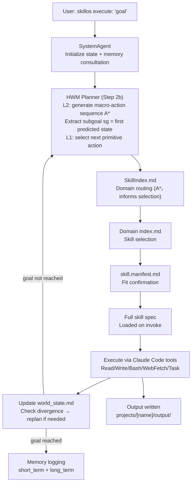

# SkillOS Architecture

## Overview

SkillOS is a Pure Markdown Operating System. The LLM runtime (Claude Code, Qwen, or Gemini) reads markdown specifications and interprets them as a functional OS — selecting the right skill, loading its context, and executing the described behavior using real tools.

There is no compiled code interpreting the markdown. The LLM **is** the interpreter.

---

## Core Abstraction: Agents and Tools

Every component in SkillOS is either:

- **Agent** — a decision maker. Receives a goal, reasons about it, delegates to tools or other agents, returns a result.
- **Tool** — an executor. Receives parameters, performs a concrete action (file I/O, web fetch, bash), returns output.

Both are defined as markdown documents with YAML frontmatter:

```markdown
---
name: my-agent
type: agent                          # or: tool
domain: orchestration                # skill tree domain
family: core                         # skill tree family
extends: orchestration/base          # inherits shared behaviors
version: 1.0.0
description: One-line description used for routing decisions
tools: [Read, Write, WebFetch]       # Claude Code native tools available
---

# MyAgent

## Purpose
...

## Instructions
1. Step one
2. Step two
```

---

## Hierarchical Skill Tree

Skills are organized in a 3-level taxonomy:

```
Domain → Family → Skill
```

```
system/skills/
├── SkillIndex.md                        # Top-level routing index (~50 lines)
│
├── orchestration/                       # Goal execution, workflow orchestration
│   ├── base.md                          # Shared orchestration behaviors
│   ├── index.md                         # Domain routing table
│   └── core/
│       ├── system-agent.manifest.md     # 15-line routing manifest
│       ├── system-agent.md              # Full spec v3 (~350 lines, includes HWM step)
│       └── claude-code-tool-map.md      # Tool → cost/latency reference
│
├── planning/                            # HWM two-level hierarchical planning
│   ├── base.md                          # MPPI protocol, world state schema, cost fn
│   ├── index.md                         # hwm vs flat selector heuristic
│   ├── hwm/         → hwm-planner-agent  (arXiv:2604.03208)
│   └── flat/        → flat-planner-agent (Stage 2 / simple goals)
│
├── memory/                              # Learning, history, pattern extraction
│   ├── base.md
│   ├── index.md
│   ├── analysis/    → memory-analysis-agent
│   ├── consolidation/ → memory-consolidation-agent
│   ├── query/       → query-memory-tool
│   └── trace/       → memory-trace-manager
│
├── validation/                          # Health checks, integrity, security
│   ├── base.md
│   ├── index.md
│   ├── system/      → validation-agent
│   └── security/    → skill-security-scan-agent
│
├── recovery/                            # Error handling, circuit breaker
│   ├── base.md
│   ├── index.md
│   └── error/       → error-recovery-agent
│
├── project/                             # Scaffolding, package management
│   ├── base.md
│   ├── index.md
│   ├── scaffold/    → project-scaffold-tool
│   └── packages/    → skill-package-manager-tool
│
└── robot/                               # Physical robot control
    ├── base.md                          # Cognitive Trinity shared behaviors
    ├── index.md
    ├── navigation/  → roclaw-navigation-agent
    ├── scene/       → roclaw-scene-analysis-agent
    ├── dream/       → roclaw-dream-agent
    └── tools/       → roclaw-tool, evolving-memory-tool
```

---

## Lazy Loading Protocol

Routing uses a 4-step lazy loading pattern that reduces token consumption by ~61% compared to loading all skill specs upfront:

```
Step 1  Identify domain from goal keywords        (no file reads)
Step 2  Load SkillIndex.md (~50 lines)         → get domain index path
Step 3  Load domain/index.md (~30–60 lines)    → select skill + manifest path
Step 4  Load skill.manifest.md (~15 lines)     → confirm fit, get full_spec path
Step 5  Load full spec (~250–330 lines)        → ONLY when ready to invoke
```

### Example: Routing "install a new skill"

```
keywords: "install", "skill"
→ domain: project
→ load system/skills/project/index.md
→ match: skill-package-manager-tool
→ load system/skills/project/packages/skill-package-manager-tool.manifest.md
→ confirm: invoke_when includes "install skill" ✓
→ load full spec only now
```

---

## Skill Inheritance

Each domain has a `base.md` defining shared behaviors for all skills in that domain. Skills declare inheritance in their frontmatter:

```yaml
extends: validation/base
```

The LLM merges the base behaviors with the skill's own spec at runtime. No code inheritance — just markdown composition.

**Example: `validation/base.md` defines:**
- All validation skills are read-only
- Report format: HEALTHY / DEGRADED / CRITICAL
- Escalation rules to SystemAgent

Any skill extending `validation/base` automatically inherits these behaviors without repeating them.

---

## Agent Discovery

Claude Code discovers agents from `.claude/agents/`. SkillOS populates this directory in tiers:

| Tier | Source | Notes |
|------|--------|-------|
| 1 | `system/skills/` tree | Primary — skill tree agents via `full_spec:` path |
| 2 | `system/agents/` stubs | Backward-compat redirects (skipped if Tier 1 matches) |
| 3 | `projects/*/components/agents/` | Project-specific agents (namespaced with project prefix) |

Run `./setup_agents.sh` (Mac/Linux) or `.\setup_agents.ps1` (Windows) to populate `.claude/agents/` initially. The script is skill-tree-aware (v3.0).

---

## Dynamic Agent Creation

When SystemAgent detects a capability gap during execution, it creates new agents at runtime:

1. **Gap Detection** — SystemAgent identifies missing capability via domain indexes
2. **Agent Generation** — Creates a new `.md` file with proper YAML frontmatter (including `extends: {domain}/base`)
3. **Manifest Creation** — Creates companion `.manifest.md` for routing
4. **Storage** — Saves to `projects/[ProjectName]/components/agents/`
5. **Index Registration** — Adds entry to the relevant domain `index.md`
6. **Discovery** — Auto-copies to `.claude/agents/` with project prefix
7. **Invocation** — Uses new agent immediately via Claude Code's `Task` tool

This means the system gains new capabilities at runtime — no pre-programming, no restarts.

---

## Project Structure

Every execution creates or reuses a project directory:

```
projects/[ProjectName]/
├── components/
│   ├── agents/          # Project-specific agents (markdown)
│   └── tools/           # Project-specific tools
├── input/               # Input documents
├── output/              # Generated deliverables
├── memory/
│   ├── short_term/      # Per-session interaction logs
│   └── long_term/       # Consolidated insights across sessions
└── state/               # Execution state (plan, context, variables)
```

**Naming convention:** Goal content determines project name automatically.
- "chaos theory tutorial" → `projects/Project_chaos_theory_tutorial/`
- "news intelligence" → `projects/Project_news_intelligence/`

---

## Execution Flow

The execution loop integrates the **HWM planning step** (Step 2b) between memory consultation
and skill routing. The planner produces a subgoal and selects the first macro-action, which
directly informs which skill is invoked in Step 3.



### HWM Planning Step Detail

```
world_state.md ──► L2 World Model ──► macro-action sequence A*
                        │
                        └── A*₁ = next skill to invoke
                        └── sg  = subgoal (first predicted state) ──► subgoal.md
                                         │
                                         ▼
                              L1 World Model ──► primitive action p*₁
                                         │
                                         ▼
                                   Execute p*₁
                                         │
                                   Update world_state.md
                                         │
                              divergence > 0.3? ──► replan (L2 again)
                              steps ≤ 3?        ──► switch to flat-planner
                              goal reached?     ──► done
```

---

## Skill Package Manager

SkillOS includes an apt-like package manager for installing skills from external sources. See [docs/skills.md](skills.md) for skill authoring and [docs/security.md](security.md) for the pre-install security gate.

```bash
skillos execute: "skill install research-assistant-agent"
skillos execute: "skill search quantum"
skillos execute: "skill update"
skillos execute: "skill list"
```

Sources are configured in `system/sources.list`. Installed skills are tracked in `system/packages.lock` with version, hash, source, and security scan verdict.

---

## Claude Code Native Tools

SkillOS maps its markdown tool abstractions to Claude Code's native tools:

| Claude Code Tool | SkillOS Usage |
|-----------------|---------------|
| `Read` | File reading, frontmatter parsing |
| `Write` | File creation, output generation |
| `Edit` | Incremental file modification |
| `Glob` | File pattern discovery |
| `Grep` | Content search |
| `Bash` | System commands, git operations |
| `WebFetch` | Live web content retrieval |
| `Task` | Sub-agent delegation |
| `Agent` | Specialized agent spawning |

Full mapping with cost/latency estimates: `system/skills/orchestration/core/claude-code-tool-map.md`
